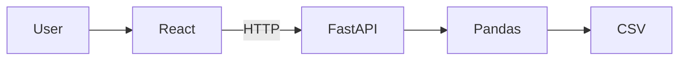

# Technology Stack

## Purpose

This document describes the technologies used to build Version 1 of the AI Data Profiling Platform and explains why each technology was selected.

---

## Technology Overview

| Technology | Purpose |
|------------|---------|
| React | Build the user interface |
| FastAPI | Create backend REST APIs |
| Pandas | Read and analyze CSV datasets |
| Git | Version control |
| GitHub | Source code hosting and collaboration |
| Postman | API testing |
| VS Code | Development environment |
| Render | Deploy the application |

---

## React

**Purpose**
- Build an interactive web interface.
- Allow users to upload datasets.
- Display the generated data quality report.

**Why React?**
- Component-based architecture.
- Fast and responsive UI.
- Industry-standard frontend framework.

---

## FastAPI

**Purpose**
- Build REST APIs.
- Receive uploaded CSV files.
- Coordinate the profiling process.
- Return results to the frontend.

**Why FastAPI?**
- High performance.
- Simple syntax.
- Automatic API documentation.
- Widely used for Python backend development.

---

## Pandas

**Purpose**
- Read CSV files.
- Perform data profiling.
- Calculate statistics and identify quality issues.

**Why Pandas?**
- Industry-standard data analysis library.
- Efficient tabular data processing.
- Rich set of built-in functions.

---

## Git

**Purpose**
- Track project changes.
- Maintain version history.
- Enable safe experimentation and rollback.

---

## GitHub

**Purpose**
- Host the project repository.
- Store project history.
- Manage project tasks and documentation.

---

## Postman

**Purpose**
- Test backend APIs independently before integrating with the frontend.

---

## VS Code

**Purpose**
- Primary development environment for writing, debugging, and managing the project.

---

## Render

**Purpose**
- Deploy the application.
- Make the project accessible through a public URL.
- Host the backend (and later the frontend if required).

---

## Version 1 Stack Summary

